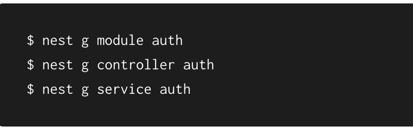

# Nestjs Authentication and Authorization

In this backend app will go step by step on how to create a security (Authentication and Authroizaion) app using Nest (NestJS) framework

    

# A- Authentication

Authentication is an essential part of most applications. There are many different approaches and strategies to handle authentication.

## Creating an authentication module

We'll start by generating an "AuthModule" and in it, an "AuthService" and an "AuthController". We'll use the "AuthService" to implement the authentication logic, and the AuthController to expose the authentication endpoints.

  1.  

## Creating user module

As we implement the AuthService, we'll find it useful to encapsulate user operations in a UsersService, so let's generate that module and service now:

  2.  

# Implementing the authentication guard

Protecting endpoints by requiring a valid JWT be present on the request.
We'll do this by creating an AuthGuard that we can use to protect our routes.

  2.  

We're applying the AuthGuard that we just created to the GET /profile route so that it will be protected.

Ensure the app is running, and test the routes using cURL

  5.  

  6.  

  7.  

  8.  

  9.  

  
# B- Authorization

Authorization refers to the process that determines what a user is able to do. For example, an administrative
user is allowed to create, edit, and delete posts. A non-administrative user is only authorized to read the posts.
Authorization is orthogonal and independent from authentication. However, authorization requires an authentication mechanism.
